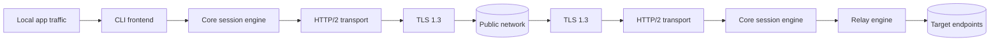

# SLPP/1 — Secure Lightweight Proxy Protocol

**Document type:** Software Design Document  
**Audience:** Junior software engineers  
**Primary implementation target:** low-end Linux servers, CLI-first  
**Primary implementation language:** Go  
**Priority:** performance first  
**Secondary goal:** future cross-platform GUI based on the same core engine

---

## 1. Scope

SLPP/1 is a lightweight proxy tunnel for protecting user traffic on untrusted networks.

This revision is constrained by the following product goals:

1. **CLI first**
2. **Runs efficiently on low-end Linux servers**
3. **Written in Go**
4. **Uses TLS**
5. **Supports UDP carried inside a TCP-based tunnel**
6. **External traffic should look like ordinary HTTPS**
7. **Must be extensible into a future cross-platform GUI application without rewriting the protocol core**

The transport profile remains:

```text
TCP
└── TLS 1.3
    └── HTTP/2
        └── SLPP binary frames
```

TLS 1.3 provides confidentiality and integrity between client and server. HTTP/2 provides multiplexing and flow control over a single connection. TCP provides a reliable, in-order byte stream. These properties are defined in RFC 8446, RFC 9113, and RFC 9293 respectively.

---

## 2. Refined product position

### 2.1 What this tool is

This tool is a **high-performance CLI proxy client/server pair** with a narrow scope:

- one persistent tunnel connection
- multiple logical channels inside that connection
- low memory overhead
- low syscall count
- deterministic framing
- simple deployment on Linux

### 2.2 What this tool is not

This tool is **not**:

- a browser impersonation framework
- a general-purpose anonymity system
- a full VPN in v1
- a plugin-heavy desktop-first product
- a protocol that optimizes for maximum flexibility over runtime efficiency

### 2.3 Product split

The system should be split into 4 layers:

```text
cmd/slppc        -> client CLI
cmd/slppd        -> server daemon
internal/core    -> protocol engine, scheduler, buffers, auth, framing
internal/platform-> sockets, epoll/kqueue abstractions, OS integration
```

Future GUI products must reuse the same `internal/core` logic through a stable local API instead of duplicating protocol logic.

---

## 3. Design decision changes in this refinement

This revision changes the design emphasis in 5 ways.

### Change A — server-first Linux optimization

The previous version was protocol-correct. This version is also **runtime-oriented**.

New rule:

- optimize first for **Linux amd64** and **Linux arm64**
- keep portability at source level
- accept platform-specific fast paths in non-core packages

### Change B — pure Go as default build mode

Use **pure Go** by default.

Avoid cgo in the core client and server binaries unless there is a measured and material gain. Pure Go simplifies deployment and cross-compilation. Go’s tooling supports cross-compilation with `GOOS` and `GOARCH`, and Go documentation notes that cross-compiling pure Go executables is straightforward while cgo is disabled in typical cross-compilation flows.

### Change C — CLI/API separation for GUI future

Do **not** build GUI assumptions into the protocol engine.

Instead:

- `slppc` and `slppd` are CLI programs now
- the GUI later talks to the same engine through a local control API
- the protocol core remains headless

This keeps the hot data path free of UI dependencies.

### Change D — performance before configurability

v1 should expose a **small config surface**.

Avoid a large matrix of runtime toggles for:

- buffer strategies
- schedulers
- congestion heuristics
- multiple auth formats
- many transport modes

Every extra branch on the hot path has cost.

### Change E — Wails-compatible future GUI path

For a future cross-platform GUI, prefer a Go-friendly desktop shell such as **Wails**, which is explicitly positioned for building cross-platform desktop apps using Go. That keeps the protocol core in Go instead of forcing a rewrite in another runtime.

---

## 4. Requirements

## 4.1 Functional requirements

The system MUST:

- establish a client-to-server tunnel over TCP/443
- use TLS 1.3
- negotiate HTTP/2 via ALPN `h2`
- support proxied TCP streams
- support proxied UDP datagrams encapsulated inside the TCP-based tunnel
- multiplex multiple logical channels over one outer connection
- expose a CLI client and a CLI server
- support daemon mode on Linux
- allow future GUI control without changing the wire protocol

## 4.2 Non-functional requirements

The system MUST prioritize:

1. throughput
2. low latency overhead
3. low CPU cost per byte
4. bounded memory usage
5. predictable behavior under load

The system SHOULD:

- run acceptably on 1 vCPU / 512 MB RAM Linux VPS class machines
- avoid background allocations on steady-state hot paths where possible
- avoid large per-channel buffers
- avoid per-packet goroutine creation

---

## 5. Core architecture



### 5.1 Client-side modules

```text
client/
  config
  bootstrap
  auth
  session
  channel
  udp
  tcp
  socks5
  metrics
  controlapi
```

### 5.2 Server-side modules

```text
server/
  listener
  tls
  h2session
  auth
  scheduler
  tcprelay
  udprelay
  quotas
  metrics
  admin
```

### 5.3 Shared core modules

```text
core/
  frame
  codec
  ringbuf
  slab
  timerwheel
  errors
  protocol
```

---

## 6. Runtime architecture for performance

This section is the main refinement.

### 6.1 Event model

Use a **small fixed number of long-lived goroutines**, not one goroutine per small unit of work.

Recommended model per client session:

```text
1 goroutine  -> outbound writer
1 goroutine  -> inbound reader
1 goroutine  -> session scheduler / channel dispatch
N goroutines -> relay workers (bounded small pool)
```

Do not create:

- one goroutine per UDP packet
- one goroutine per frame encode
- one goroutine per timer

### 6.2 Buffer policy

Use **reusable fixed-size buffers**.

Recommended:

- frame header: stack or fixed array
- payload buffers: slab or sync.Pool-backed reusable byte slices
- per-channel queues: ring buffers with hard caps

Avoid:

- unbounded `bytes.Buffer`
- large chained allocations
- per-frame heap allocation if avoidable

### 6.3 Memory caps

Set explicit limits.

Suggested v1 defaults:

- max channels per session: `128`
- max payload per SLPP frame: `16 KiB`
- max queued bytes per channel: `64 KiB`
- max queued bytes per session: `8 MiB`
- max UDP datagram accepted from local side: `1200 bytes`

Reasoning:

- HTTP/2 default frame payload size is 16,384 bytes unless peers negotiate otherwise
- smaller caps reduce retransmission and queue amplification
- 1200-byte UDP datagrams align better with conservative Internet path sizes and reduce fragmentation pressure

### 6.4 Queueing policy

The system must use **bounded queues**.

Per-channel queue overflow rules:

- TCP channel: block briefly, then fail channel if pressure persists
- UDP channel: drop oldest expired datagrams first, then newest if still full

Session queue scheduling should use:

- weighted round-robin or deficit round-robin
- separate queue classes for control, TCP, UDP
- control frames always highest priority

### 6.5 Timers

Do not create a dedicated Go timer for each channel if channel count is high.

Use a **timer wheel** or coarse bucket scheduler for:

- idle timeout checks
- UDP reassembly expiry
- heartbeat timing
- auth renewal checks

This reduces timer heap churn.

---

## 7. Transport profile

## 7.1 Outer transport

- TCP port 443
- TLS 1.3 only
- ALPN `h2`
- HTTP/2 POST request with long-lived body stream

TLS 1.3 is preferred modern TLS. ALPN is defined for negotiating the application protocol during the TLS handshake. HTTP/2 is negotiated with `h2`.

## 7.2 HTTP/2 usage pattern

Use **one persistent HTTP/2 request/response pair per session**.

Client to server:
- SLPP frames written into request body DATA frames

Server to client:
- SLPP frames written into response body DATA frames

Do not use:

- one HTTP request per proxied channel
- one HTTP request per UDP datagram
- frequent reconnects for normal steady-state traffic

### 7.3 HTTP/2 tuning

Use a stable and small tuning profile.

Suggested defaults:

- connection count per client session: `1`
- request count per session: `1`
- disable unnecessary transport features not needed for the tunnel
- enlarge flow-control windows only after measurement

Start with:

```text
SETTINGS_INITIAL_WINDOW_SIZE: moderate increase
SETTINGS_MAX_FRAME_SIZE: leave default initially
```

Do not increase frame size first. Measure first.

---

## 8. Wire protocol

## 8.1 Frame header

Keep the frame header fixed-size and easy to parse.

```text
0                   1                   2                   3
0 1 2 3 4 5 6 7 8 9 0 1 2 3 4 5 6 7 8 9 0 1 2 3 4 5 6 7 8 9 0 1
+--------+--------+--------+--------+---------------------------+
| Ver(1) | Type(1)| Flags(1)| HLen(1)| Session ID (4)           |
+---------------------------------------------------------------+
| Channel ID (4)                                               |
+---------------------------------------------------------------+
| Seq (4)                                                      |
+---------------------------------------------------------------+
| Payload Length (4)                                           |
+---------------------------------------------------------------+
```

Header length: `20 bytes`

All integers are big-endian.

## 8.2 Frame types

| Code | Name | Scope | Purpose |
|------|------|-------|---------|
| 0x01 | AUTH | session | authenticate client |
| 0x02 | AUTH_OK | session | auth accepted |
| 0x03 | AUTH_ERR | session | auth rejected |
| 0x10 | SETTINGS | session | runtime limits |
| 0x11 | PING | session | liveness |
| 0x12 | PONG | session | liveness response |
| 0x20 | OPEN_TCP | channel | open TCP relay |
| 0x21 | OPEN_OK | channel | channel opened |
| 0x22 | OPEN_ERR | channel | channel open failed |
| 0x23 | TCP_DATA | channel | TCP payload |
| 0x24 | TCP_CLOSE | channel | close TCP channel |
| 0x30 | OPEN_UDP | channel | open UDP association |
| 0x31 | UDP_DATA | channel | UDP datagram or fragment |
| 0x32 | UDP_CLOSE | channel | close UDP association |
| 0x7E | ERROR | both | protocol/runtime error |
| 0x7F | SESSION_CLOSE | session | graceful close |

## 8.3 Parsing rules

Parser rules:

- never trust `payload_len`
- reject unknown version
- reject `header_len < 20`
- reject oversized payload before allocation
- reject frames for unknown channels unless protocol state allows them
- parse header first, then dispatch payload decode by type

---

## 9. UDP over TCP design

This tool must support UDP inside a TCP-based tunnel.

That means the system inherits TCP’s ordered delivery behavior. TCP loss and retransmission can delay later UDP data carried in the same outer stream.

### 9.1 Design goal for UDP mode

The target is not “perfect UDP semantics”.

The target is:

- acceptable behavior for DNS
- acceptable behavior for light control traffic
- usable behavior for some interactive traffic under moderate loss
- bounded damage under congestion

### 9.2 UDP association model

Each UDP channel represents **one remote endpoint** in v1.

```text
OPEN_UDP(remote host, remote port)
UDP_DATA(datagram)
UDP_CLOSE()
```

This keeps routing simple and reduces per-packet metadata.

### 9.3 UDP frame body

```text
+--------------------+
| Datagram ID (4)    |
+--------------------+
| Sent Time MS (4)   |
+--------------------+
| Deadline MS (2)    |
+--------------------+
| Frag Index (2)     |
+--------------------+
| Frag Count (2)     |
+--------------------+
| Datagram Len (2)   |
+--------------------+
| Fragment bytes     |
+--------------------+
```

### 9.4 UDP deadlines

Use deadlines aggressively.

Suggested defaults:

- DNS/general UDP: `1000 ms`
- interactive mode: `300 ms`

If a datagram exceeds deadline before delivery, drop it.

### 9.5 UDP fragmentation

Fragment only when required.

Rules:

- prefer no fragmentation
- cap local accepted UDP size to `1200 bytes`
- fragment only if a trusted local source still exceeds payload cap
- drop incomplete reassembly after timeout

---

## 10. Authentication and security model

## 10.1 Recommended v1 auth format

Use **opaque bearer token** or a compact binary HMAC token.

Do not start with JWT unless there is a clear product requirement.

Reason:

- more parsing work
- more allocation pressure
- more implementation surface
- no required performance benefit for v1

### 10.2 Recommended token fields

For compact HMAC token mode:

```text
version      u8
key_id       u16
client_id    u64
issued_at    u64
expires_at   u64
nonce        12 bytes
scope_bits   u32
mac          32 bytes
```

### 10.3 Replay protection

- disable TLS 0-RTT by default
- require token expiry
- require nonce uniqueness within token lifetime
- maintain small replay cache on server

TLS guidance documents and RFC 8446 warn that 0-RTT has replay considerations and requires explicit application handling.

---

## 11. Linux-first deployment design

## 11.1 Server process model

Recommended server modes:

```text
slppd run        # foreground
slppd service    # long-running daemon mode
slppd check      # config validation
slppd bench      # local benchmark mode
slppd stats      # local runtime stats
```

### 11.2 Linux integration

v1 Linux integration targets:

- systemd service unit
- journald or plain stdout logging
- ulimit documentation
- graceful SIGTERM handling
- optional Unix domain socket control endpoint

### 11.3 Socket tuning

Document but do not overcomplicate initial socket tuning.

Possible tuned values after benchmarking:

- `SO_REUSEADDR`
- TCP keepalive
- kernel receive/send buffer sizes
- file descriptor limit recommendations

Do not hard-code aggressive socket tuning before measurement.

---

## 12. CLI design

The CLI is the main product surface in v1.

## 12.1 Client CLI

Suggested commands:

```text
slppc connect
slppc socks5
slppc check
slppc ping
slppc stats
slppc version
```

### 12.2 Example client usage

```bash
slppc socks5 \
  --server https://proxy.example.com \
  --token-file /etc/slpp/token \
  --listen 127.0.0.1:1080
```

### 12.3 Server CLI

Suggested commands:

```text
slppd run
slppd check
slppd gen-token
slppd revoke-token
slppd stats
slppd version
```

### 12.4 CLI output rules

CLI output must support:

- human-readable mode
- JSON mode

Example:

```bash
slppc stats --json
slppd check --json
```

This is required for future GUI reuse and automation.

---

## 13. GUI-compatible future architecture

The GUI must be an outer control layer, not part of the tunnel core.

## 13.1 Required separation

Create a local control API between UI and engine.

Two valid options:

### Option A — embedded engine mode

```text
GUI process
└── links internal Go engine directly
```

Good for desktop packaging.

### Option B — sidecar daemon mode

```text
GUI process
└── local control API
    └── slppc engine process
```

Better isolation. Easier restart logic.

### 13.2 Control API shape

Recommended local API:

- Unix domain socket on Linux/macOS
- Named pipe on Windows later
- JSON-RPC or compact local HTTP API

Control API responsibilities:

- connect/disconnect
- config read/write
- live stats
- log streaming
- profile selection
- token import

Control API must never carry the hot data path.

### 13.3 Recommended GUI path

Use **Wails** for a future Go-based desktop application path.

Reasoning:

- Go-based integration
- cross-platform desktop packaging focus
- avoids splitting core logic into a separate runtime

This is an architectural recommendation, not a protocol dependency.

---

## 14. Go implementation guidance

## 14.1 Project layout

```text
slpp/
  cmd/
    slppc/
    slppd/
  internal/
    core/
    transport/
    auth/
    relay/
    control/
    bench/
  pkg/
    api/
  docs/
  testdata/
```

## 14.2 Library choices

Prefer:

- standard library first
- `golang.org/x/net/http2` only where lower-level control is needed
- no heavy dependency graph in the hot path

Go documentation notes that most users get HTTP/2 automatically through `net/http`, while `x/net/http2` exists for lower-level control.

## 14.3 Build profile

Recommended default build flags for release investigation:

```bash
go build -trimpath -ldflags="-s -w"
```

Benchmark optional flags separately.

### 14.4 Cross-compilation examples

```bash
GOOS=linux   GOARCH=amd64 go build ./cmd/slppc
GOOS=linux   GOARCH=arm64 go build ./cmd/slppc
GOOS=windows GOARCH=amd64 go build ./cmd/slppc
GOOS=darwin  GOARCH=arm64 go build ./cmd/slppc
```

For low-end Linux focus, official build targets should start with:

- linux/amd64
- linux/arm64

---

## 15. Performance plan

Performance is the highest priority. That requires an explicit measurement plan.

## 15.1 Benchmark categories

### A. Protocol microbenchmarks

Measure:

- frame encode ns/op
- frame decode ns/op
- allocations per frame
- ring buffer push/pop cost
- UDP reassembly cost

### B. Session benchmarks

Measure:

- one session, one TCP channel
- one session, many TCP channels
- one session, mixed TCP + UDP
- one session under packet loss simulation

### C. Server benchmarks

Measure:

- active sessions per core
- throughput per core
- memory per active channel
- auth validation throughput

## 15.2 Required metrics

At minimum collect:

- bytes in/out
- frames in/out
- active channels
- queue occupancy
- dropped UDP datagrams
- expired UDP datagrams
- auth failures
- reconnect count
- allocations/sec
- GC pause data

## 15.3 Initial target numbers

Initial engineering targets for v1:

- steady-state allocations near zero on framed data path after warmup
- median added tunnel latency on LAN: `< 3 ms`
- memory per active channel in steady state: `< 64 KiB`
- single-session throughput on modest hardware: measure first, optimize second

The exact throughput target must be hardware-profiled, not guessed.

---

## 16. Failure behavior

## 16.1 Fail-fast rules

Fail session immediately on:

- invalid auth
- malformed frame header
- oversized payload attempt
- session memory cap breach
- repeated protocol violations

## 16.2 Fail-soft rules

Fail only the affected channel on:

- target connection refused
- UDP remote unreachable
- channel idle timeout
- per-channel queue overflow

## 16.3 Reconnect policy

Client reconnect policy:

- exponential backoff
- bounded jitter
- token refresh before reconnect if close to expiry

Do not reconnect in a tight loop.

---

## 17. Testing plan

## 17.1 Unit tests

Must cover:

- header encode/decode
- frame round-trip tests
- channel state transitions
- UDP fragment reassembly
- timeout expiry logic
- replay cache behavior

## 17.2 Integration tests

Must cover:

- TLS 1.3 connection establishment
- ALPN `h2`
- one long-lived POST tunnel
- TCP echo relay
- UDP DNS relay
- abrupt remote close
- server restart behavior

## 17.3 Stress tests

Must cover:

- channel churn
- many small UDP packets
- slow consumer behavior
- queue overflow behavior
- token replay attempts

## 17.4 Bench tests

Automate:

```bash
go test -bench . -benchmem ./...
```

Store historical benchmark outputs per release.

---

## 18. Recommended phased implementation

## Phase 1 — minimal high-performance tunnel

Implement:

- TLS 1.3
- HTTP/2 tunnel bootstrap
- AUTH / AUTH_OK
- OPEN_TCP / TCP_DATA / TCP_CLOSE
- minimal metrics
- CLI client/server

## Phase 2 — UDP support

Implement:

- OPEN_UDP / UDP_DATA / UDP_CLOSE
- datagram deadlines
- fragmentation and reassembly
- queue caps

## Phase 3 — operations

Implement:

- systemd integration
- JSON stats
- token management CLI
- replay cache tuning
- bench tooling

## Phase 4 — GUI foundation

Implement:

- local control API
- config profile model
- event stream for logs/stats
- Wails-based prototype shell

---

## 19. Final v1 recommendation

For this product profile, the recommended design is:

**TLS 1.3 + HTTP/2 over TCP/443 + compact fixed-size binary framing + bounded queues + pure Go CLI-first architecture + headless core reusable by a future GUI wrapper.**

The engineering rule for v1 is:

**do not add a feature unless it survives profiling.**

---

## 20. Reference implementation notes for juniors

When implementing this system, apply these rules in order:

1. make it correct
2. make memory bounded
3. make the hot path allocation-light
4. measure
5. only then optimize further

When choosing between two designs with similar correctness, prefer the design that:

- allocates less
- copies less
- wakes fewer goroutines
- has fewer branches on the hot path
- has fewer configuration states

---

## References

1. RFC 8446 — The Transport Layer Security (TLS) Protocol Version 1.3  
   https://datatracker.ietf.org/doc/html/rfc8446

2. RFC 9113 — HTTP/2  
   https://www.rfc-editor.org/rfc/rfc9113.html

3. RFC 9293 — Transmission Control Protocol (TCP)  
   https://www.rfc-editor.org/rfc/rfc9293.html

4. RFC 9298 — Proxying UDP in HTTP  
   https://www.rfc-editor.org/rfc/rfc9298.html

5. RFC 7301 — TLS Application-Layer Protocol Negotiation Extension  
   https://datatracker.ietf.org/doc/html/rfc7301

6. Go documentation: `golang.org/x/net/http2` overview  
   https://docs-go.hexacode.org/pkg/golang.org/x/net/http2/

7. Go Wiki: Building Windows Go programs on Linux  
   https://tip.golang.org/wiki/WindowsCrossCompiling

8. Go Wiki: Go on ARM  
   https://go.dev/wiki/GoArm

9. Wails project site  
   https://wails.io/
